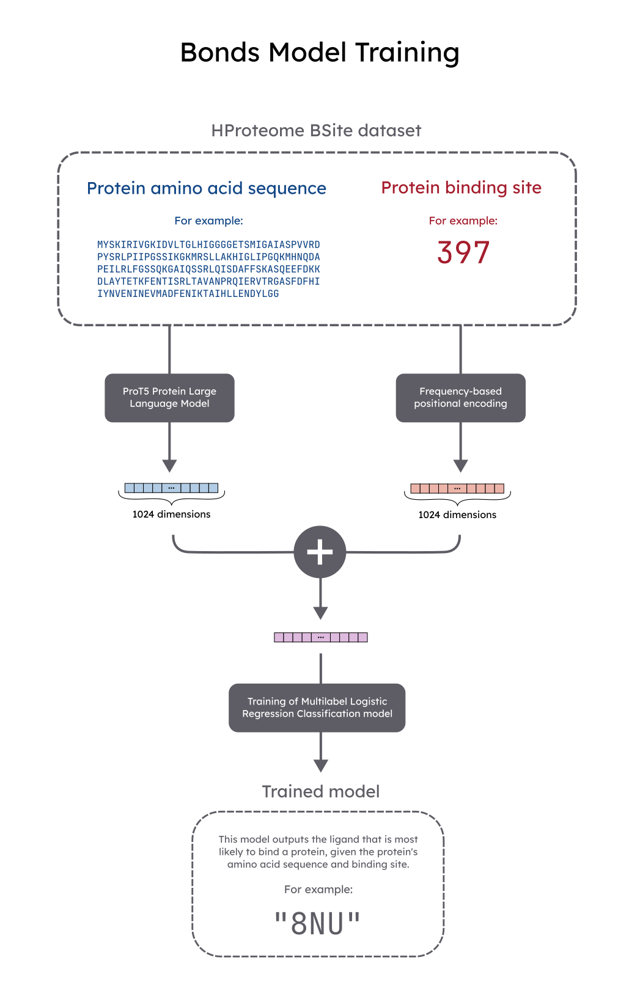

# Bonds

Bonds is a machine learning project that uses protein large language models (pLLMs) to predict protein-ligand interaction. It focuses on the human proteome (i.e. the proteins of the human body), and aims to be most applicable in the fields of medicine and pharmacology.

We used the ProT5 pre-trained model for generating amino acid sequence embeddings, since this model has had proven success in creating embeddings that can be used as the sole input of annotation tasks. As for our training data, we used the HProteome-BSite dataset, which contains hundreds of thousands of protein-ligand pairs.

## Motivation

Proteins are composed of chained organic molecules called amino acids. These molecules are often represented with their one-letter abbreviations, so chains of amino acids can be represented as sequences of letters, like so:

`MSTGKVQVGRV`

In this particular sequence, we have the amino acids:

- M: Methionine
- S: Serine
- T: Threonine
- G: Glycine
- K: Lysine
- V: Valine
- Q: Glutamine
- R: Arginine

Amino acids interact electrostatically with each other, so proteins fold into complex three-dimensional structures. Some proteins conform to a structure that favors the "fitting" of specific molecules. The molecules that "fit" to these proteins are called **ligands**. Hence, this interaction is called protein-ligand binding. The study of protein-ligand binding is very relevant to several areas of knowledge, being crucial (among other applications) in drug discovery and biofuel production.

## Methodos

Below is a diagram that summarizes the training process for Bonds.

A detail that is ommited in this diagram is that we didn't actually need run ProT5 to generate the embeddings for the HProteome BSite proteins ourselves. Instead, we used the pre-computed embeddings made available in [UniProtKB/Swiss-Prot](https://www.expasy.org/resources/uniprotkb-swiss-prot).

## References

1. UniProtKB/Swiss-Prot. Expasy.org. Published 2019. https://web.expasy.org/docs/swiss-prot_guideline.html

2. Elnaggar A, Heinzinger M, Dallago C, et al. ProtTrans: Towards Cracking the Language of Lifes Code Through Self-Supervised Deep Learning and High Performance Computing. IEEE Transactions on Pattern Analysis and Machine Intelligence. Published online 2021:1-1. doi:https://doi.org/10.1109/tpami.2021.3095381

3. Sarker B, Shome S, Rahman F, Aghaeepour N. Tutorial VT2: Protein Sequence Analysis using Transformer-based Large Language Model. Published July 2023. Accessed June 4, 2024. https://github.com/Bishnukuet/ISMB_ECCB_2023_Tutorial-VT2-LLM-For-Protein-Sequence-Analysis

4. Saeed M. A Gentle Introduction to Positional Encoding In Transformer Models, Part 1. Machine Learning Mastery. Published January 31, 2022. https://machinelearningmastery.com/a-gentle-introduction-to-positional-encoding-in-transformer-models-part-1/

5. Sim J, Kwon S, Seok C. HProteome-BSite: predicted binding sites and ligands in human 3D proteome. Nucleic acids research. 2022;51(D1):D403-D408. doi:https://doi.org/10.1093/nar/gkac873

6. Heo L, Shin WH, Lee MS, Seok C. GalaxySite: ligand-binding-site prediction by using molecular docking. Nucleic Acids Research. 2014;42(W1):W210-W214. doi:https://doi.org/10.1093/nar/gku321

7. Sage Bionetworks. CAFA - UniProt Metal Binding Challenge. www.synapse.org. Accessed June 4, 2024. https://www.synapse.org/Synapse:syn50209128/wiki/6202598.Residue (chemistry). Wikipedia. Published November 16, 2022. https://en.wikipedia.org/wiki/Residue_(chemistry)

9. Druglikeness. Wikipedia. Published November 23, 2023. https://en.wikipedia.org/wiki/Druglikeness

10. PDB101: Learn: Guide to Understanding PDB Data: Small Molecule Ligands. RCSB: PDB-101. Accessed June 5, 2024. https://pdb101.rcsb.org/learn/guide-to-understanding-pdb-data/small-molecule-ligands

11. Wang R, Fang X, Lu Y, Wang S. The PDBbind Database:  Collection of Binding Affinities for Protein−Ligand Complexes with Known Three-Dimensional Structures. Journal of Medicinal Chemistry. 2004;47(12):2977-2980. doi:https://doi.org/10.1021/jm030580l

12. Qu X, Swanson R, Day R, Tsai J. A Guide to Template Based Structure Prediction. Current Protein & Peptide Science. 2009;10(3):270-285. doi:https://doi.org/10.2174/138920309788452182

13. Fiser A. Template-Based Protein Structure Modeling. Methods in Molecular Biology. Published online 2010:73-94. doi:https://doi.org/10.1007/978-1-60761-842-3_6

## License

This project is licensed under the terms of the GPL-3.0.
